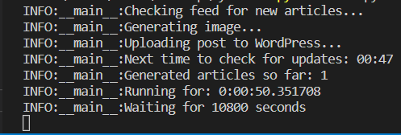

# NewsSynth - The Next Generation News Article Generator

NewsSynth is an innovative Python application that streamlines the process of generating and publishing news articles. It integrates multiple functionalities, from fetching articles from one or several RSS feeds to creating expanded content and catchy titles using OpenAI's GPT-3 and GPT-4. It also employs DALL-E to generate illustrative images and allows seamless uploading of the articles to a WordPress site.



## Motivation

With the increasing flood of information, having tools that can efficiently process and comprehend data is crucial. NewsSynth was built with the objective of automating the news article generation and publication process, thereby saving valuable time and resources. Thanks to the power of AI, NewsSynth can create high-quality, engaging content significantly faster than a human writer.

## Technologies Used

- **Python**: The primary programming language used to build the application.
- **OpenAI's GPT-3 and GPT-4**: Used for generating expanded content and compelling titles for each article.
- **DALL-E**: Employed to create images that match the content of each article.
- **WordPress XML-RPC**: Utilized to upload the crafted articles and images to a WordPress site.

## Modules

- `main.py`: The primary script that operates the application. It controls the entire workflow including fetching articles, generating content and titles, creating images, and uploading the articles to a WordPress site.
- `feed.py`: This module fetches articles from RSS feeds and expands content and titles using GPT-3 and GPT-4. It interacts with the RSS feed, GPT models, and the `config.json` file to retrieve the needed information.
- `generate.py`: Responsible for creating images that correspond with the content of each article. It uses DALL-E to generate image descriptions and then creates the relevant images based on those descriptions.
- `publish.py`: Handles the uploading of articles and images to a WordPress site using the WordPress XML-RPC library. It manages the WordPress API calls necessary for the process.
- `config.py`: Responsible for loading the configuration from the `config.json` file. It provides functions to access the configuration values, such as the RSS feed URLs, WordPress connection details, and other settings, ensuring that the application uses the correct configuration settings during runtime.
- `utils.py`: Provides utility functions used throughout the application, including handling file paths, loading and saving seen links, and performing other miscellaneous tasks needed by the application.

## Setup

1. Clone this repository.
2. Install the required Python packages:

```
pip install -r requirements.txt
```
4. Configure your settings in the `config.json` file, including RSS feed URLs, WordPress connection details, and other settings.
5. Run `main.py` to start the application.

## Configuration

NewsSynth's configuration is stored in the `config.json` file. You can customize the following parameters:

- `rss_feed_urls`: A list of RSS feed URLs for fetching articles.
- `wordpress`: Configuration settings for your WordPress site, including URL, username, password, and categories.
- `loop_delay`: The delay (in seconds) between each iteration of checking for new articles.
- `folders`: The directories to store prompts and generated images.
- `size`: The size of the generated images.
- `temperature`: The temperature parameter for GPT text generation.
- `max_tokens`: The maximum number of tokens for GPT text generation.

## Contribution

Your contributions to NewsSynth are always welcome! If you have any ideas, suggestions, or bug reports, feel free to open an issue or submit a pull request. We value your inputs to make NewsSynth even better.

## Future Updates

- **Multiple RSS Feeds**: Soon, we aim to enhance the application to support fetching from multiple RSS feeds. This feature will allow users to fetch articles from a diverse range of sources, thus expanding the scope of generated content.
- **Improved Image Generation**: We are working on ways to refine the image generation process, such as letting users specify the type of image they want (like an illustration, photo), the color scheme, and more.

## Development Log

- **Version 1.01**: Introduced modularization and configuration file support. The application has now been compartmentalized into separate scripts to manage different functionalities. It uses a configuration file (`config.json`) to handle various settings like WordPress connection details, RSS feed URLs, etc.
- **Version 1.0**: Initial release. The application could fetch articles from RSS feeds, generate expanded content and titles using GPT-3 and GPT-4, create images using DALL-E, and upload the articles to a WordPress site.

## License

This project is licensed under the terms of the MIT license.
